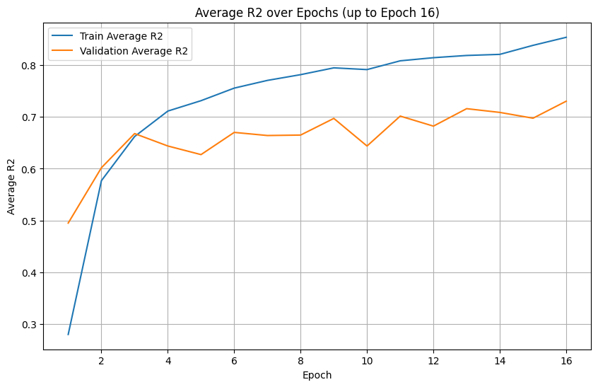
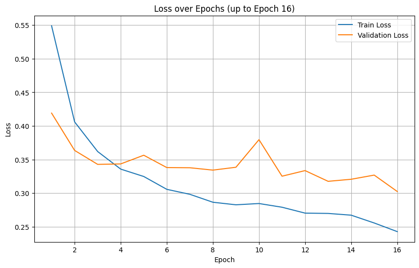
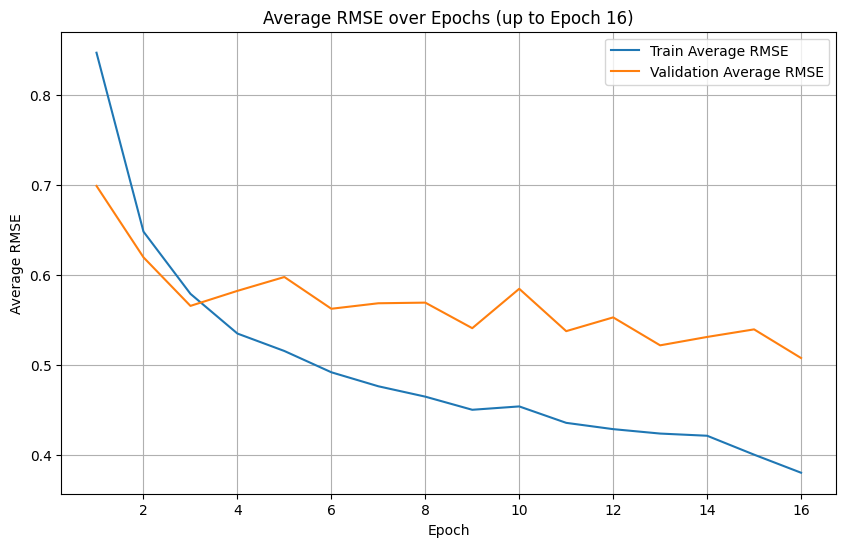
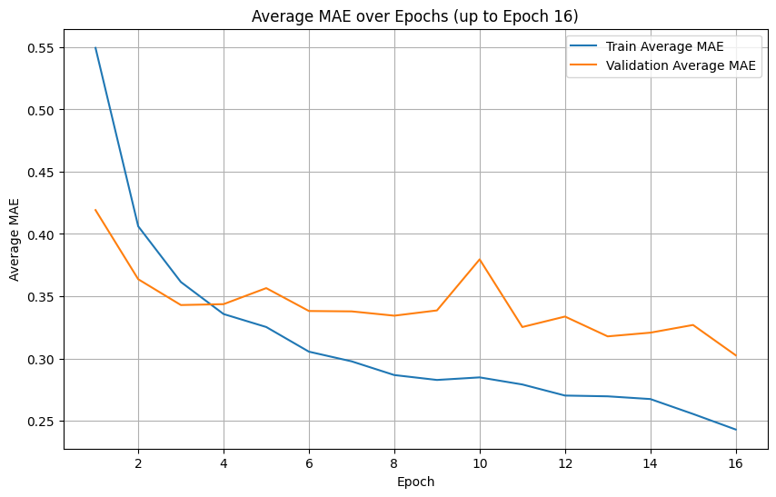
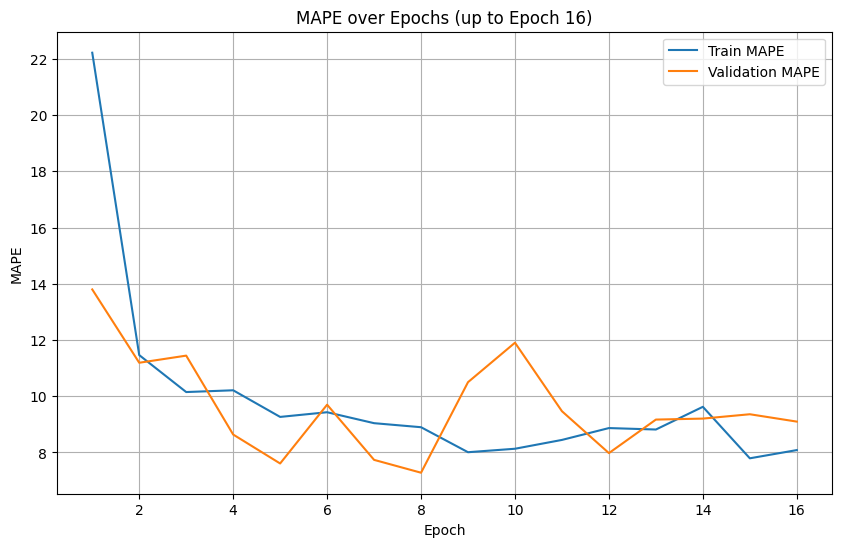
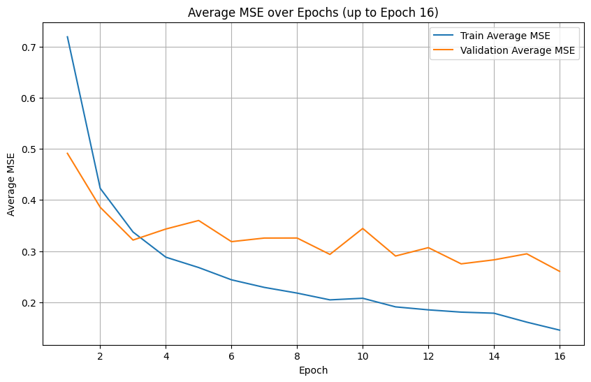

# Yemek Fotoğrafından Besin Değeri Tahmini ve Yorumlanması

**Pupilica AI Hackathon için geliştirilmiştir.**

Bu proje, tek bir yemek fotoğrafından yola çıkarak yemeğin **ağırlık (gram), kalori, yağ, karbonhidrat ve protein** değerlerini tahmin eden bir derin öğrenme modelidir. Modelin yaptığı bu sayısal tahminler, Google'ın güçlü dil modeli **Gemini 2.5 Flash**'a gönderilerek kullanıcı için anlamlı ve yorumlanmış bir çıktıya dönüştürülür. Kullanıcılar ayrıca, tahmin edilen besin değerleri hakkında Gemini'ye interaktif olarak sorular sorabilirler.

## 🚀 Uygulama

Projenin canlı demosuna aşağıdaki adresten ulaşabilirsiniz:
**[nutritionassistant.streamlit.app](http://nutritionassistant.streamlit.app)**

## Model Checkpoint
 Modelin `state_dict` dosyasına Hugging Face üzerinden ulaşabilirsiniz:  
👉 [theycallmeburki/siglip2_regressor](https://huggingface.co/theycallmeburki/siglip2_regressor)
- **Hatırlatma**: Kullanabilmek için önce model class'ı tanımlanmalı ! 

## 🛠️ Teknik Detaylar

### Model Mimarisi

Bu projede, temel olarak Google tarafından geliştirilen **Siglip2** vision encoder modeli kullanılmıştır.

-   **Transfer Learning Yaklaşımı:** Siglip2 gibi devasa bir modeli elimizdeki 4783 fotoğraflık veri setiyle baştan sona eğitmek hem hesaplama maliyeti yüksek hem de overfitting riski taşıyan bir süreçtir. Bu nedenle, modelin önceden eğitilmiş ağırlıkları dondurulmuş ve sadece son katmanda bulunan **2 katmanlı MLP (Multi-Layer Perceptron)** ve modele özel olarak eklenen **regresyon başlığı (regression head)** eğitilmiştir.
-   **Regresyon Başlığı (Regression Head):** Modelin görsel özelliklerden sayısal besin değerlerini tahmin etmesini sağlayan katman aşağıdaki gibi tasarlanmıştır:

```python
self.reg_head = nn.Sequential(
    nn.ReLU(),
    nn.Dropout(0.3),
    nn.Linear(hidden_size, output_dim) # output_dim = 5 (ağırlık, kalori, yağ, karb, protein)
)
```

Bu yaklaşım, büyük bir modelin güçlü görsel anlama yeteneğinden faydalanırken, kendi özel görevimiz için modeli hızlı ve verimli bir şekilde adapte etmemizi sağlamıştır.

### Eğitim Detayları

Modelin eğitimi sırasında aşağıdaki optimizasyon ve öğrenme oranı stratejileri kullanılmıştır:

-   **Loss Fonksiyonu:** Modelin tahminleri ile gerçek değerler arasındaki hatayı ölçmek için `L1Loss` (Mean Absolute Error) kullanılmıştır.
    ```python
    loss_fn = nn.L1Loss()
    ```
-   **Optimizer:** Ağırlıkların güncellenmesi için `AdamW` optimizer tercih edilmiştir. Bu optimizer, standart Adam'a göre ağırlık bozunmasını (weight decay) daha etkili bir şekilde uygular.
    ```python
    optimizer = torch.optim.AdamW(params=model.parameters(), lr=5e-5)
    ```
-   **Öğrenme Oranı Zamanlayıcısı (Scheduler):** Eğitim boyunca öğrenme oranını dinamik olarak ayarlamak için `OneCycleLR` stratejisi kullanılmıştır. Bu strateji, eğitim başlangıcında öğrenme oranını yavaşça artırır, maksimum bir değere ulaştırır ve ardından eğitimin sonuna doğru kademeli olarak azaltır. Bu, modelin daha hızlı ve daha kararlı bir şekilde yakınsamasına yardımcı olur.
    ```python
    scheduler = OneCycleLR(optimizer, max_lr=0.001, steps_per_epoch=len(train_loader), epochs=NUM_EPOCHS, div_factor=20.0)
    ```

### Veri Seti (Dataset)

-   **Kaynak:** Projede **Nutrition5k** veri seti kullanılmıştır.
-   **Veri Seçimi:** Veri setinin `side_angled_images` klasöründen, her bir yemek için farklı açılardan çekilmiş fotoğraflar arasından rastgele sadece bir tanesi seçilerek toplam **4793** resimlik bir veri havuzu oluşturulmuştur.
-   **Veri Temizliği (Data Cleaning):** Veri seti incelendiğinde, yaklaşık 10 adet görsel için `8000 gram` gibi absürt ve hatalı değerler girildiği tespit edilmiştir. Regresyon görevlerinde bu tür aykırı değerler (outliers), modelin performansını ciddi şekilde düşürebilir ve metriklerin yanlış yorumlanmasına neden olabilir. Bu nedenle, hatalı olduğu doğrulanan bu veriler eğitim setinden çıkarılarak modelin daha stabil ve doğru öğrenmesi sağlanmıştır.

## 📊 Eğitim Süreci ve Sonuçlar

Model, early stopping mekanizması devreye girerek eğitilmiş ve en iyi doğrulama performansını gösterdiği 16. epoch’ta kaydedilmiştir. Eğitim sonunda elde edilen metrikler aşağıdaki gibidir.

**Not:** Vektör olarak verilen metrikler sırasıyla `[Ağırlık, Kalori, Yağ, Karbonhidrat, Protein]` değerlerine karşılık gelmektedir.

### Metrik Tablosu (Epoch: 16)

| Metrik     | Train Değerleri                         | Validation Değerleri                    |
| :--------- | :-------------------------------------- | :-------------------------------------- |
| **Loss** | 0.2428                                  | 0.3025                                  |
| **R² Score** | `[0.89, 0.88, 0.83, 0.82, 0.86]`        | `[0.83, 0.75, 0.65, 0.71, 0.71]`        |
| **RMSE** | `[0.33, 0.35, 0.41, 0.42, 0.39]`        | `[0.42, 0.48, 0.57, 0.55, 0.52]`        |
| **MAPE** | 8.09%                                   | 9.10%                                   |
| **MAE** | `[0.23, 0.23, 0.25, 0.28, 0.23]`        | `[0.27, 0.30, 0.33, 0.35, 0.28]`        |
| **MSE** | `[0.11, 0.12, 0.17, 0.18, 0.15]`        | `[0.17, 0.23, 0.33, 0.30, 0.27]`        |
| **LR** | 0.000998                                | -                                       |


### Metrik Grafikleri

<table>
<tr>
  <td></td>
  <td></td>
</tr>
<tr>
  <td></td>
  <td></td>
</tr>
<tr>
  <td></td>
  <td></td>
</tr>
</table>


---

**Proje Burak Özdemir tarafından geliştirilmiştir. Sorularınız için: ozdemrburak@yahoo.com adresinden ulaşabilirsiniz.**
